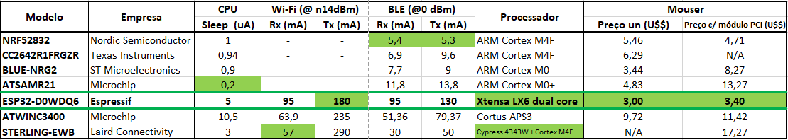

# Home-Automation-System (HAS)
O HAS é um sistema de automação residencial, ao qual existem alguns módulos que se comunicam através de um serviço de núvem.

Requerimentos:
1. **Controle de acesso**
    1. Um *controle de acesso* com reconhecimento de rosto (por exemplo: abrir uma trava elétrica de 12V)
    2. Uma interface de registro, permitindo acesso por reconhecimento de face para vários usuários
    3. Um registro de dados contendo uma lista de eventos de acesso anteriores (válidos, inválidos e pânico) com a respectiva hora e data
    
2. **Interface**
    1. Uma interface web para monitoramento de dados do sensor
    2. Uma interface da web que fornece o registro de dados de eventos de acesso e o status do sensor
    3. Uma interface de dados local que contém o registro de dados de eventos de acesso
  
3. **Segurança dos dados**
    1. Dados criptografados no servidor web
    
4. **rede sem fio**
    1. Os sensores sem fio devem comunicar com um gateway seus respectivos estados e valores de sensores
   
5. **Monitores e atuadores**
    1. Câmera (para reconhecimento de rosto / controle de acesso)
    2. Sensores de temperatura sem fio (bateria)
    3. Sensores de janela e porta abertos / fechados
    4. Switches inteligentes (tomadas inteligentes)
    5. Motorista para controlar portas e persianas
    6. O sistema deve ter um relógio de tempo real para fornecer registro de hora e data

6. **Consumo de energia**
    1. Os sensores sem fio devem ter mais de 2 anos de vida útil
    
# Análise de mercado:
A equipe reuniu informações sobre microprocessadores com interfaces sem fio. Aqui está o resultado:

  

# Diagrama de blocos do sistema
    

# Servidor Web

Para a realização do projeto é necessária a utilização de um servidor web, onde serão armazenados os dados do sistema (valores dos sensores, imagens, etc). Alguns problemas giram em torno disso:

- Segurança no envio e recebimento dos dados e no servidor utilizado
- Armazenamento e acesso dos dados, onde fazer e como fazer?
- Tempo de desenvolvimento desse sistema
- Custo operacional

Como o projeto é de curto prazo e com equipe pequena sem expertise no assunto, a melhor solução foi encontrar um servidor web pronto, onde paga-se apenas pelo serviço utilizado, fazendo com que a equipe ganhe tempo para se preocupar com outras peculiaridades do projeto.

Foi feita uma pesquisa sobre alguma empresa que poderia disponibilizar esse tipo de serviço de base de dados online com algum serviço de acesso e as mais populares encontradas atualmente foram:

- AWS
- Microsoft Azure
- Google cloud

Cada um deles tem vários serviços web diferentes, que por sua vez podem ser integrados dentro da plataforma de cada fornecedor. Neste [link](https://intellipaat.com/blog/aws-vs-azure-vs-google-cloud/) há um vídeo que mostra diferenças básicas nos serviços, incluindo popularidade, variedade de serviços, preços, etc. 

Estudando um pouco as empresas, e também o material disponível pela [espressif](https://github.com/espressif) foi possível constatar que tanto a AWS quanto o Microsoft Azure atendiam os nossos requisitos de serviços e também tinham algum tipo de material pronto para aceleração do desenvolvimento do projeto á um preço parecido. Os fatores que levaram a uma decisão foram:

- **Documentação**
  - O serviço com a melhor documentação, usualmente, torna o tempo de desenvolvimento mais rápido
- **Usabilidade**
  - Com uma boa usabilidade, o serviço permite que a equipe se concentre com o desenvolvimento de outras partes do projeto sem ter que se preocupar tanto em como tornar o serviço utilizavel
- **Popularidade**
  - Aprender a utilizar uma ferramenta popular facilita a realização de futuros projetos que tem mais chances de utilizar essa mesma ferramenta

Nesses quisitos o serviço da Amazon tem um pouco de vantagem em comparação com o serviço da Microsoft, fazendo com que esta seja a escolha para nosso projeto.

## AWS

A [AWS](https://aws.amazon.com/pt/) é uma plataforma que permite os usuários a acessarem vários serviços diferentes dessa plataforma, permitindo também a integração desses serviços.

Dentre esses serviços, os serviços que serão utilizados serão o AWS IoT (Internet das coisas) e o DynamoDB (Banco de dados). A escolha desses serviços está intrínsecamente ligada com os exemplos disponibilizados pela [espressif](https://github.com/espressif/esp-aws-iot) que disponibiliza um exemplo com uma implementação pronta para o serviço MQQT do [AWS IoT](https://docs.aws.amazon.com/pt_br/iot/latest/developerguide/aws-iot-how-it-works.html) que por sua vez pode ser integrado diretamente através de regras com a base de dados DynamoDB.

Primeiramente para a utilização de serviços da amazon, primeiramente deve-se ter uma conta. E para isso utilizamos o AWS Educate que é uma conta na Amazon fornecida por uma parceria da instituição de ensino com a plataforma que disponibiliza alguns serviços e créditos para utilização de serviços com o intuito de familiarizar o estudante com as ferramentas.

## Espressif AWS IoT

Para a utilização do ESP-32 em conjunto com os serviços da Amazon, há um repositório fornecido pela empresa com um tutorial de como criar um dispositivo remoto na AWS e certificar o ESP-32 como esse dispositivo. Após isto, o exemplo fornecido pela espressif pode ser compilado e gravado no microcontrolador, em conjunto com a própria documentação do ESP-32.

Após todo o procedimento descrito anteriormente o microcontrolador, através de uma rede wifi manda uma requisição de escrita no MQQT client da AWS IoT, que por sua vez escreve no mesmo podendo ser observado na própria plataforma do AWS IoT.

	

# Modulos desenvolvidos

Há basicamente 3 módulos desenvolvidos no projeto:

-   Camera
-   Sensores
-   Atuadores

Sendo cada um desses módulos responsável por algum tipo de operação no sistema.

## Módulo camera

O módulo camera é responsável pelo cadastro de faces e reconhecimento facil do sistema, que por sua vez, ativa um atuador quando reconhecida uma face. A seguir uma imagem do módulo.

O processamento de dados é baseado em dois frameworks [esp-who](https://github.com/espressif/esp-who) e [esp-face](https://github.com/espressif/esp-face). O módulo se conecta numa rede wifi, juntamente com um computador que tem uma interface html, onde é possível detectar-se uma pessoa não cadastrada (intruder alert), apertando "enroll face" é possível o cadastro de uma face e então após o cadastro o rosto é detectado como "sample" e quando ocorre uma detecção o módulo envia uma string para o servidor AWS que é lida por um módulo atuador, abrindo a porta de entrada da residencia. A seguir 3 imagens mostrando o processo de cadastramento.

## Módulo atuador

O módulo atuador é responsável por ligar um relé. Esse relé funciona como chave de uma tomada no nosso caso. A seguir duas imagens mostrando o módulo.

Este módulo utiliza uma fonte retificadora de 220 AC para 5V DC, um ESP-32 e um Relé de 220V/10A.

O funcionamento é bastante simple, este módulo está inscrito em um tópico MQTT. Toda vez que algo é publicado neste tópico, o módulo analisa a mensagem e toma uma ação dependendo do conteúdo.

Nesse caso existem 3 mensagens possíveís:

-   Acesso concedido!
    Ativa o relé por um pequeno instante de tempo simulando uma tranca e depois o desativa
-   Liga tomada
    Ativa o relé
-   Desliga tomada
    Desativa o relé

# Solutions:
* **BLE/WI-FI Gateway**
  - ESP32-CAM module
    - ESP-IDF
      - FreeRTOS 8 Espressif's fork
    - ESP-FACE
    - ESP-WHO
    - Azure-IoT Espressif API
    
* **Wireless BLE sensors**
  - Battery powered
  - Espressif'S ESP32 microcontroller
    - Two cores 
  - **Must design hardware module with ESP32 + sensors**
  - Two basic sensors:
    - ADC sensor for temperature reading (e.g: LM35)
    - GPIO ON/OFF sensor for open/closed door event
  - Transistors controlling current drain in sensors - "sensor sleep mode"
* **Connected BLE actuators**
  - 220Vac-5Vdc powered
  - Relay with normally closed phase

# Tools
  - 1x ESP32-CAM module
  - 3x ESP32-01 module
  - 1x Segger J-Link
  - 1x JSN-SR04T
  - 1x LM35
  - 1x AC 220V/DC 5V converter
  - 1x Relay 5V
 
# Contributors
Rodrigo Belisário Ramos (rodbelisario) Rodigo Luiz da Costa (rodrigo-lc) Tarcis Aurélio Becher (tarciszera)

