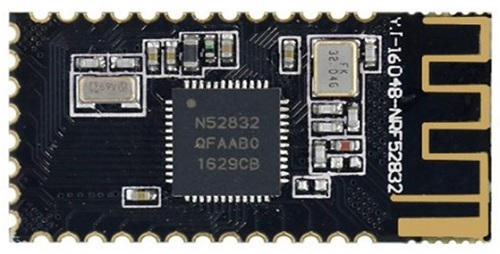

# ble-home-automation (bha)
A sensor network using modular BLE sensors and an ESP32 as a gateway and also a gatekeeper (literally), providing an access control system with face recognition.

# requirements:

- A wireless network capable to control sensors and actuators for residential applications
- A camera to capture images for facial recognition processing
- Gateway Wi-Fi to store data in a webserver
- Local Access control data storage
- Data security

# solution/hardware requirements
* **BLE/WI-FI Gateway**
  - ESP32-CAM module
    - ESP-IDF
      - FreeRTOS 8 Espressif's fork
    - ESP-FACE
    - ESP-WHO
    - Azure-IoT Espressif API
    
* **Wireless BLE sensors**
  - Battery powered
  - Nordic Semiconductor's NRF52832 microcontroller
    - ARM Cortex-M4F (with floating point ALU)
  - **Must design hardware module with NRF52832 + sensors**
  - Two basic sensors:
    - ADC sensor for temperature reading (e.g: LM35)
    - GPIO ON/OFF sensor for open/closed door event
  - Transistors controlling current drain in sensors - "sensor sleep mode"
* **Connected BLE actuators**
  - 220Vac-5Vdc powered
  - Relay with normally closed phase
  - Nordic Semiconductor's NRF52832 microcontroller
    - ARM Cortex-M4F (with floating point ALU)
    

# system datapath
  
  
# tools
  - 1x ESP32-CAM
  - 3x NRF52832
  - 1x Segger J-Link
  - 1x JSN-SR04T
  - 1x LM35
  - 1x AC 220V/DC 5V converter
  - 1x Relay 5V
 
# contributors
Rodrigo Belisário Ramos (rodbelisario) Rodigo Luiz da Costa (rodrigo-lc) Tarcis Aurélio Becher (tarciszera)

